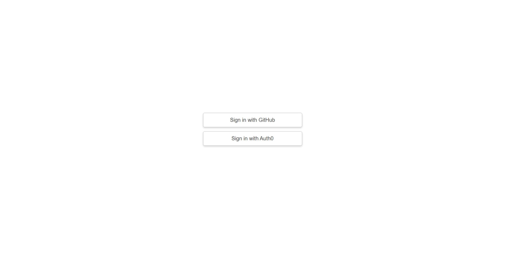
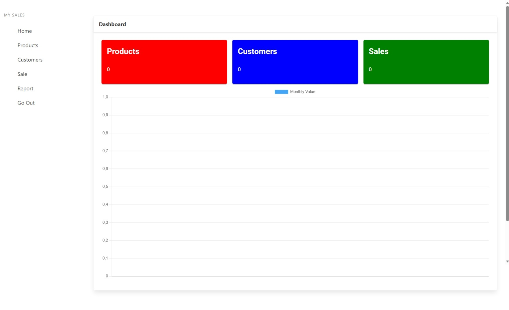

## Setup and Run Commands

```bash
sudo -u postgres psql -c "CREATE DATABASE sales;"
sudo snap install ripgrep
sudo apt install maven
mvn -version
mvn compile
mvn test
mvn spring-boot:run
mvn clean install
mvn exec:java -Dexec.mainClass="com.example.Main"
mvn package
```

## Add `.properties` Files Back

The repository currently ignores all `.properties` files via `.gitignore` (`**/*.properties`).

If your local files were removed, recreate them from the example and run the app:

```bash
cp config.properties.example src/main/resources/application.properties
cp src/main/resources/application-prod.properties src/main/resources/application-hom.properties
```

Then update values in:

- `src/main/resources/application.properties`
- `src/main/resources/application-prod.properties`
- `src/main/resources/application-hom.properties`
- `system.properties`

Create `system.properties` in the project root:

```bash
echo "java.runtime.version=11" > system.properties
```

`system.properties` should contain:

```properties
java.runtime.version=11
```

If you intentionally want to track these files in git again, force add them:

```bash
git add -f src/main/resources/application.properties
git add -f src/main/resources/application-prod.properties
git add -f src/main/resources/application-hom.properties
git add -f system.properties
```

To stop force-adding in the future, replace `**/*.properties` in `.gitignore` with specific ignore rules (for example, only `config.properties`).

## Restore Database From SQL Dump

Use the provided SQL dump at `documents/database.sql`.
This file starts with `CREATE DATABASE SALES;`, so use one of the flows below.

```bash
# Full reset and restore (recommended)
sudo -u postgres psql -c "DROP DATABASE IF EXISTS sales;"
sudo -u postgres psql -c "CREATE DATABASE sales;"
sed '1d' ./documents/database.sql | sudo -u postgres psql -d sales
```

Alternative (keep database, reset schema only):

```bash
sudo -u postgres psql -d sales -c "DROP SCHEMA public CASCADE; CREATE SCHEMA public;"
sed '1d' ./documents/database.sql | sudo -u postgres psql -d sales
```

Note: `could not change directory ... Permission denied` may appear when running `sudo -u postgres` from your home folder. It is usually a warning and can be ignored if the import continues.

## API URL

[http://localhost:8080](http://localhost:8080)

## Screenshots


